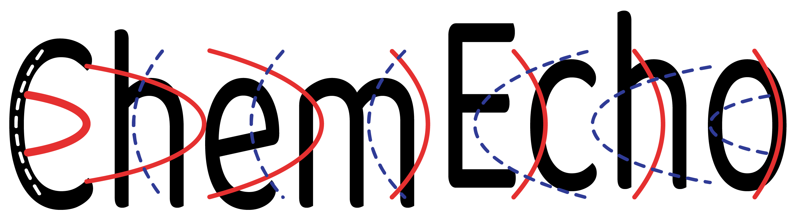
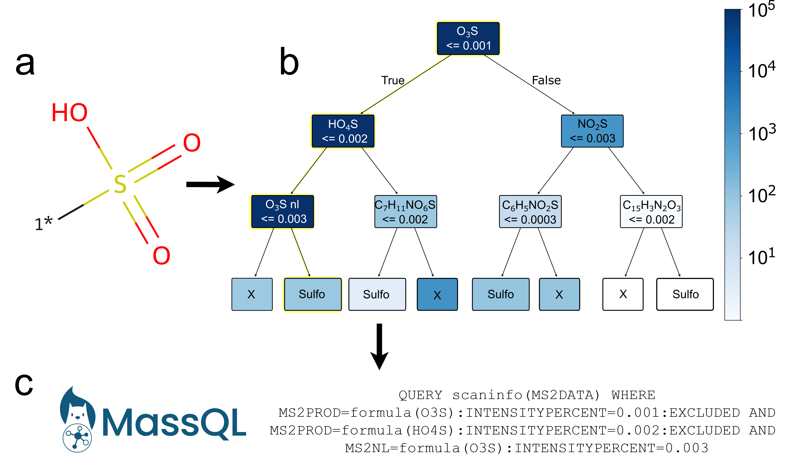

# ChemEcho


# Building Interpretable Machine Learning Models
ChemEcho is a tool for converting tandem mass spectra into sparse feature vectors, enabling the training of interpretable machine learning models. Rather than mapping fragmentation data into a latent space, ChemEcho represents features as unique peak or neutral loss formulas. The resulting sparse, high-dimensional feature vectors are well-suited for models that handle sparse inputs, such as regression and tree-based architectures.

This tool is designed for applications where interpretability is essential, including:

- Evaluating model predictions to ensure reliability and trust.
- Generating hypotheses about underlying fragmentation patterns.
- Approximating black-box predictions (e.g., through methods like [LIME](https://dl.acm.org/doi/10.1145/2939672.2939778)) to improve understanding.

# Example: Generating MassQL Queries from Raw Data
The [Mass Query Language (MassQL)](https://mwang87.github.io/MassQueryLanguage_Documentation/) is a domain specific language used to describe fragmentation patterns (and other attributes) of tandem mass spectra. Using ChemEcho vectors, we can train decision trees which are able to be directly converted to MassQL for straightforward deployment, and to more easily evaluate the prediction criteria. Shown here is a shallow decision tree trained to predict the presence of a sulfo group, and the resulting query built from one path of the tree.



# Installation
```
git clone https://github.com/biorack/chemecho
cd chemecho
pip install .
```
Or
```
pip install git+https://github.com/biorack/chemecho.git#egg=chemecho
```
# License
# Acknowledgements
The DOE Joint Genome Institute \
Lawrence Berkeley National Laboratory \
The National Energy Research Scientific Computing Center


